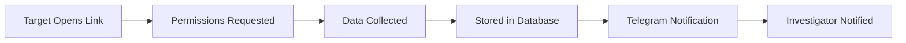

# 🔍 TELE-TRACKER

<div align="center">

```
████████╗███████╗██╗     ███████╗      ████████╗██████╗  █████╗  ██████╗██╗  ██╗███████╗██████╗ 
╚══██╔══╝██╔════╝██║     ██╔════╝      ╚══██╔══╝██╔══██╗██╔══██╗██╔════╝██║ ██╔╝██╔════╝██╔══██╗
   ██║   █████╗  ██║     █████╗  █████╗   ██║   ██████╔╝███████║██║     █████╔╝ █████╗  ██████╔╝
   ██║   ██╔══╝  ██║     ██╔══╝  ╚════╝   ██║   ██╔══██╗██╔══██║██║     ██╔═██╗ ██╔══╝  ██╔══██╗
   ██║   ███████╗███████╗███████╗         ██║   ██║  ██║██║  ██║╚██████╗██║  ██╗███████╗██║  ██║
   ╚═╝   ╚══════╝╚══════╝╚══════╝         ╚═╝   ╚═╝  ╚═╝╚═╝  ╚═╝ ╚═════╝╚═╝  ╚═╝╚══════╝╚═╝  ╚═╝
```

**Advanced OSINT & Telegram Intelligence Suite**

[](https://www.python.org/downloads/)
[](LICENSE)
[](https://core.telegram.org/bots)
[](https://flask.palletsprojects.com/)

*Developed by [@Guruprasad](https://github.com/Guruprasad) | A gx_security product*

[Features](#-features) • [Installation](#-installation) • [Usage](#-usage) • [Documentation](#-documentation) • [Legal Notice](#-legal-notice)

</div>

---

## 📋 Table of Contents

- [Overview](#-overview)
- [Features](#-features)
- [Prerequisites](#-prerequisites)
- [Installation](#-installation)
- [Configuration](#-configuration)
- [Usage](#-usage)
- [Telegram Bot Commands](#-telegram-bot-commands)
- [API Endpoints](#-api-endpoints)
- [Project Structure](#-project-structure)
- [Security Considerations](#-security-considerations)
- [Troubleshooting](#-troubleshooting)
- [Legal Notice](#-legal-notice)
- [Contributing](#-contributing)
- [License](#-license)

---

## 🎯 Overview

**TELE-TRACKER** is a sophisticated Open Source Intelligence (OSINT) gathering tool designed for security researchers, investigators, and law enforcement professionals. It combines real-time location tracking, image collection, and Telegram bot integration to provide a comprehensive intelligence gathering platform.

### Key Capabilities

- 🌐 **Real-time Geolocation Tracking** - Capture and monitor GPS coordinates with accuracy metrics
- 📸 **Image Intelligence** - Automated image collection and cataloging
- 🤖 **Telegram Integration** - Instant notifications and remote control via Telegram bot
- 🔒 **Secure Access** - HTTP Basic Authentication and encrypted communications
- 💾 **Data Persistence** - SQLite database for comprehensive data storage
- 🌍 **Public URL Generation** - Cloudflare tunnel for secure external access

---

## ✨ Features

### Core Functionality

| Feature | Description |
|---------|-------------|
| **Location Tracking** | Captures GPS coordinates with precision, accuracy radius, and timestamp |
| **IP & User-Agent Logging** | Records visitor IP addresses and browser information |
| **Image Upload & Storage** | Automatically saves and catalogs uploaded images |
| **Telegram Notifications** | Real-time alerts sent directly to authorized Telegram users |
| **Database Management** | SQLite backend for persistent data storage and retrieval |
| **Cloudflare Tunneling** | Secure public URL generation without port forwarding |
| **Web Dashboard** | User-friendly interface for interaction |
| **Authentication System** | Multi-layer security with key-based access control |

### Advanced Features

- 📊 **Rich Console Output** - Beautiful terminal interface with status updates
- 🔐 **User Authentication** - Key-based Telegram bot authentication
- 🗺️ **Google Maps Integration** - Direct links to tracked locations
- 🗑️ **Remote Data Management** - Delete collected data via Telegram commands
- 📱 **Cross-Platform Support** - Works on Windows, Linux, and macOS

---

## 🔧 Prerequisites

Before installing TELE-TRACKER, ensure you have the following:

### System Requirements

- **Operating System**: Windows 10/11, Linux (Ubuntu 18.04+), or macOS 10.14+
- **Python**: Version 3.8 or higher
- **RAM**: Minimum 2GB (4GB recommended)
- **Storage**: At least 100MB free space

### Required Software

- Python 3.8+
- pip (Python package manager)
- Cloudflared executable
- Telegram account

### API Requirements

- **Telegram Bot Token** - Obtain from [@BotFather](https://t.me/botfather)

---

## 📥 Installation

### Step 1: Clone the Repository

```bash
git clone https://github.com/yourusername/tele-tracker.git
cd tele-tracker
```

### Step 2: Install Python Dependencies

```bash
pip install -r requirements.txt
```

**Required packages:**
```
Flask==2.3.0
Flask-HTTPAuth==4.8.0
python-telegram-bot==20.0
requests==2.31.0
rich==13.7.0
```

### Step 3: Download Cloudflared

#### Windows
1. Download `cloudflared.exe` from [Cloudflare releases](https://github.com/cloudflare/cloudflared/releases)
2. Place `cloudflared.exe` in the project root directory

#### Linux/macOS
```bash
# Linux
wget https://github.com/cloudflare/cloudflared/releases/latest/download/cloudflared-linux-amd64
chmod +x cloudflared-linux-amd64
mv cloudflared-linux-amd64 cloudflared

# macOS
brew install cloudflared
```

### Step 4: Create Required Directories

```bash
mkdir -p saved_files static
```

### Step 5: Create Static Files

Create `static/index.html` with your custom tracking interface (HTML/CSS/JavaScript).

---

## ⚙️ Configuration

### 1. Telegram Bot Setup

1. **Create a Bot**:
   - Message [@BotFather](https://t.me/botfather) on Telegram
   - Send `/newbot` and follow the prompts
   - Copy the bot token provided

2. **Configure Bot Token**:
   ```python
   # In app.py, line 126
   TELEGRAM_BOT_TOKEN = "YOUR_BOT_TOKEN_HERE"
   ```

3. **Set Authentication Key**:
   ```python
   # In app.py, line 127
   AUTHORIZED_KEY = "your_secret_key_here"
   ```

### 2. Web Authentication

Configure basic auth credentials:
```python
# In app.py, line 71
users = {"admin": "your_password_here"}
```

### 3. Database Configuration

The SQLite database (`osint_data.db`) is automatically created on first run with the following schema:

```sql
CREATE TABLE osint_data (
    id INTEGER PRIMARY KEY AUTOINCREMENT,
    type TEXT,
    latitude REAL,
    longitude REAL,
    accuracy REAL,
    timestamp TEXT,
    ip_address TEXT,
    user_agent TEXT,
    file_path TEXT
)
```

---

## 🚀 Usage

### Starting the Application

1. **Run the main script**:
   ```bash
   python app.py
   ```

2. **Expected Output**:
   ```
   ✓ Starting Cloudflare tunnel...
   🌐 Public URL: https://xxxxxxxx.trycloudflare.com
   ✅ URL is now active and reachable!
   🤖 Starting Telegram bot...
   ✅ Telegram bot is running!
   ```

3. **Access the Interface**:
   - The public URL will automatically open in your browser
   - Share this URL with your target (for legitimate purposes only)

### Workflow



1. Target opens the shared URL
2. Web page requests location/camera permissions
3. Data is captured and stored in SQLite database
4. Instant notification sent to authenticated Telegram users
5. Investigator reviews data via Telegram or database

---

## 🤖 Telegram Bot Commands

### Authentication

```
/auth <your_secret_key>
```
Authenticate your Telegram account to receive notifications.

**Example**:
```
/auth secretkey123
```

### Get Server URL

```
/start
```
Retrieves the current public tunnel URL.

**Response**:
```
✅ Server is live!
🌐 URL: https://xxxxxxxx.trycloudflare.com
```

### Get Chat ID

```
/chatid
```
Displays your Telegram chat ID for configuration purposes.

### Delete All Data

```
/delete
```
Removes all collected images and clears the database (requires authentication).

**Response**:
```
🗑️ Deleted 5 image(s) and cleared database.
```

---

## 🔌 API Endpoints

### 1. Location Endpoint

**POST** `/location`

Receives and stores geolocation data.

**Request Body**:
```json
{
  "latitude": 40.7128,
  "longitude": -74.0060,
  "accuracy": 10.5
}
```

**Response**:
```json
{
  "status": "OK"
}
```

**Telegram Notification**:
```
📍 New Location Received:
Latitude: 40.7128
Longitude: -74.0060
Accuracy: ±10.5 m
📍 View on Map
IP: 192.168.1.100
UA: Mozilla/5.0...
```

### 2. Image Upload Endpoint

**POST** `/upload_image`

Accepts image uploads from the target.

**Request**:
- Method: `multipart/form-data`
- Field: `image` (file)

**Response**:
```json
{
  "status": "OK"
}
```

**Stored as**: `saved_files/image_YYYYMMDD_HHMMSS.jpg`

### 3. Main Interface

**GET** `/`

Serves the HTML interface located at `static/index.html`.

---

## 📁 Project Structure

```
tele-tracker/
│
├── app.py                  # Main application file
├── osint_data.db          # SQLite database (auto-generated)
├── cloudflared.exe        # Cloudflare tunnel executable (Windows)
├── requirements.txt       # Python dependencies
├── README.md             # Documentation
│
├── static/               # Web interface files
│   └── index.html       # Main tracking page
│
├── saved_files/         # Uploaded images storage
│   └── image_*.jpg     # Timestamped images
│
└── .gitignore          # Git ignore rules
```

---

## 🔒 Security Considerations

### ⚠️ Important Security Notes

1. **Change Default Credentials**: Always modify default passwords and keys
2. **HTTPS Only**: Cloudflare tunnels use HTTPS by default
3. **API Token Security**: Keep your Telegram bot token private
4. **Database Encryption**: Consider encrypting sensitive data at rest
5. **Access Control**: Limit tunnel access to authorized personnel only

### Best Practices

- ✅ Use strong, unique authentication keys
- ✅ Regularly update dependencies (`pip install -U -r requirements.txt`)
- ✅ Monitor database for unauthorized access attempts
- ✅ Keep `osint_data.db` in a secure location
- ✅ Use environment variables for sensitive configuration
- ❌ Never commit API tokens to version control
- ❌ Don't expose the database file publicly

### Recommended `.gitignore`

```gitignore
# Sensitive files
osint_data.db
cloudflared.exe
cloudflared

# Environment
.env
*.env

# Python
__pycache__/
*.pyc
*.pyo
*.pyd

# Data
saved_files/
*.jpg
*.png
*.jpeg
```

---

## 🐛 Troubleshooting

### Common Issues

#### Issue: Cloudflared not found
**Error**: `'cloudflared.exe' not found in current directory`

**Solution**:
```bash
# Download cloudflared from GitHub releases
# Place in project root directory
# Ensure executable permissions (Linux/macOS)
chmod +x cloudflared
```

#### Issue: Telegram bot not responding
**Error**: Bot doesn't reply to commands

**Solutions**:
1. Verify bot token is correct
2. Ensure bot is started: `/start` with [@BotFather](https://t.me/botfather)
3. Check authentication: `/auth <your_key>`
4. Review console logs for errors

#### Issue: Database locked
**Error**: `database is locked`

**Solution**:
```bash
# Stop the application
# Delete the lock file
rm osint_data.db-journal
# Restart application
python app.py
```

#### Issue: Port already in use
**Error**: `Address already in use: 127.0.0.1:5000`

**Solution**:
```bash
# Find process using port 5000
# Windows
netstat -ano | findstr :5000
taskkill /PID <PID> /F

# Linux/macOS
lsof -i :5000
kill -9 <PID>
```

### Debug Mode

Enable verbose logging:
```python
# In app.py, line 298
app.run(host='127.0.0.1', port=5000, debug=True, use_reloader=False)
```

---

## ⚖️ Legal Notice

### ⚠️ IMPORTANT: Legal and Ethical Use Only

This tool is designed for **legitimate security research, authorized penetration testing, and law enforcement purposes ONLY**. 

### Acceptable Use Cases

- ✅ Authorized security assessments
- ✅ Law enforcement investigations with proper warrants
- ✅ Personal device tracking (your own devices)
- ✅ Educational and research purposes in controlled environments
- ✅ Corporate security with employee consent

### Prohibited Use Cases

- ❌ Unauthorized surveillance
- ❌ Stalking or harassment
- ❌ Privacy invasion without consent
- ❌ Any illegal activities

### Legal Compliance

Users must comply with all applicable laws and regulations, including:
- Computer Fraud and Abuse Act (CFAA) - United States
- General Data Protection Regulation (GDPR) - European Union
- Electronic Communications Privacy Act (ECPA)
- Local privacy and surveillance laws

### Disclaimer

The developers of TELE-TRACKER:
- Do NOT endorse illegal use of this software
- Are NOT responsible for misuse by third parties
- Provide this tool "AS IS" without warranties
- Assume NO liability for damages resulting from use

**BY USING THIS SOFTWARE, YOU AGREE TO USE IT RESPONSIBLY AND LEGALLY.**

---

## 🤝 Contributing

Contributions are welcome! Please follow these guidelines:

### How to Contribute

1. **Fork the repository**
2. **Create a feature branch**:
   ```bash
   git checkout -b feature/AmazingFeature
   ```
3. **Commit your changes**:
   ```bash
   git commit -m 'Add some AmazingFeature'
   ```
4. **Push to the branch**:
   ```bash
   git push origin feature/AmazingFeature
   ```
5. **Open a Pull Request**

### Code Standards

- Follow PEP 8 style guidelines
- Add docstrings to new functions
- Include comments for complex logic
- Test thoroughly before submitting

### Reporting Issues

When reporting bugs, please include:
- Python version
- Operating system
- Error messages/logs
- Steps to reproduce

---

## 📄 License

This project is licensed under the MIT License - see the [LICENSE](LICENSE) file for details.

```
MIT License

Copyright (c) 2024 Guruprasad | gx_security

Permission is hereby granted, free of charge, to any person obtaining a copy
of this software and associated documentation files (the "Software"), to deal
in the Software without restriction, including without limitation the rights
to use, copy, modify, merge, publish, distribute, sublicense, and/or sell
copies of the Software, and to permit persons to whom the Software is
furnished to do so, subject to the following conditions:

The above copyright notice and this permission notice shall be included in all
copies or substantial portions of the Software.

THE SOFTWARE IS PROVIDED "AS IS", WITHOUT WARRANTY OF ANY KIND, EXPRESS OR
IMPLIED, INCLUDING BUT NOT LIMITED TO THE WARRANTIES OF MERCHANTABILITY,
FITNESS FOR A PARTICULAR PURPOSE AND NONINFRINGEMENT. IN NO EVENT SHALL THE
AUTHORS OR COPYRIGHT HOLDERS BE LIABLE FOR ANY CLAIM, DAMAGES OR OTHER
LIABILITY, WHETHER IN AN ACTION OF CONTRACT, TORT OR OTHERWISE, ARISING FROM,
OUT OF OR IN CONNECTION WITH THE SOFTWARE OR THE USE OR OTHER DEALINGS IN THE
SOFTWARE.
```

---

## 📞 Contact & Support

- **Developer**: [@Guruprasad](https://github.com/Guruprasad)
- **Organization**: gx_security
- **Issues**: [GitHub Issues](https://github.com/yourusername/tele-tracker/issues)
- **Discussions**: [GitHub Discussions](https://github.com/yourusername/tele-tracker/discussions)

---

## 🙏 Acknowledgments

- [Cloudflare](https://www.cloudflare.com/) for tunnel services
- [Telegram](https://telegram.org/) for bot API
- [Flask](https://flask.palletsprojects.com/) framework
- [Rich](https://github.com/Textualize/rich) for terminal formatting
- Open source community for inspiration and tools

---

## 🔄 Version History

### v2.0.0 (Current)
- ✨ Added Telegram bot integration
- ✨ Implemented Cloudflare tunneling
- ✨ Rich terminal interface
- ✨ Image upload functionality
- 🔧 SQLite database integration
- 🔒 Enhanced security features

### v1.0.0
- 🎉 Initial release
- 📍 Basic location tracking
- 💾 File storage system

---

<div align="center">

**⭐ Star this repository if you find it useful!**

**Made with ❤️ by gx_security**

*For educational and authorized use only. Use responsibly.*

</div>
